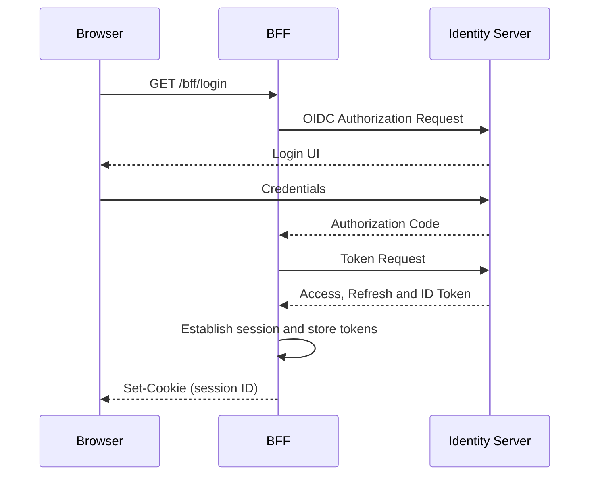
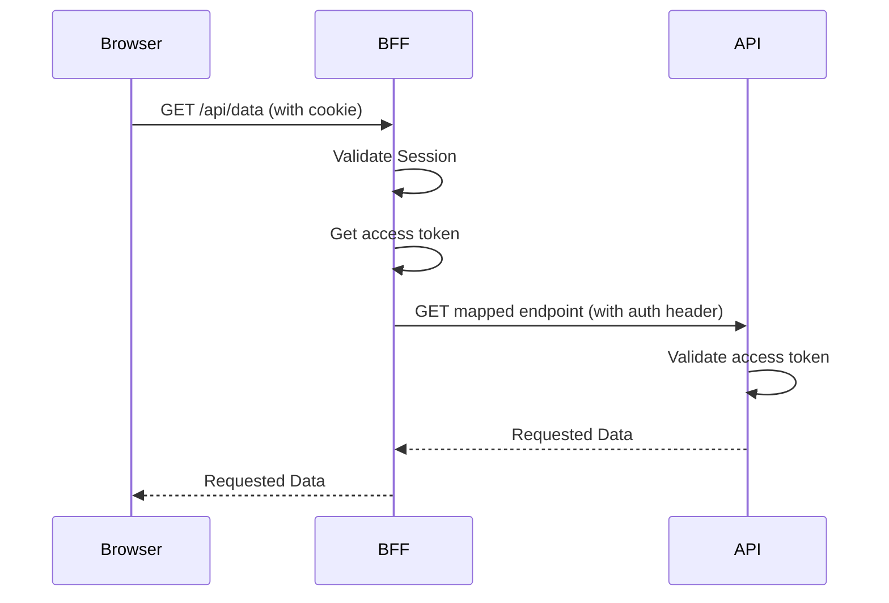

# Authentication and Session Management

The BFF creates a user session upon successful authentication. The authentication process flows through several layers.
This section aims to give a general understanding how these layers connect and interact with each other.

## Login

The BFF sets a **HttpOnly, Secure, SameSite** cookie in the browser. This cookie contains the session ID and is sent
automatically with each subsequent request. The cookie is signed and encrypted
using [ASP.NET Core's Data Protection](https://learn.microsoft.com/en-us/aspnet/core/security/data-protection/introduction?view=aspnetcore-10.0).

The browser never has access to any access or refresh tokens. They are stored on the BFF.

## Calling a protected API

The BFF retrieves the access token from the session and attaches it to the API call. If the access token is expired or
close to expiring it will refresh it using the refresh token.