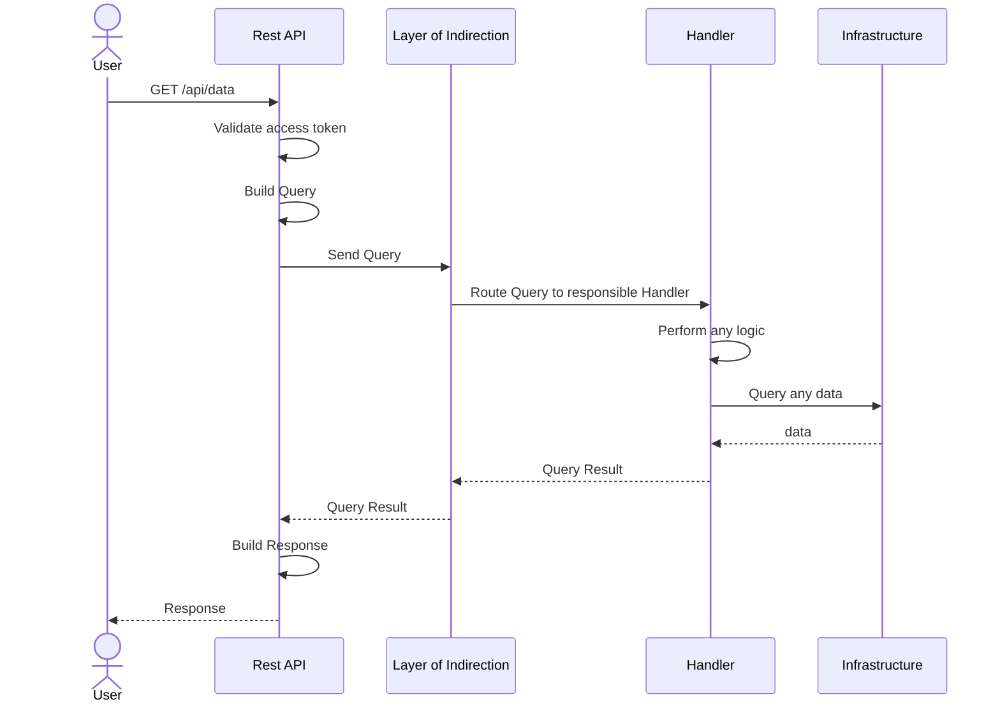

# Backend Internals

## Example Request Flow

The structure of the backend was described in the
corresponding [Level 2 Building Block View](../building-block-view/level2.md#tikal-backend).

This example shows how a simple read request is expected to travel through the layers of the backend application.

